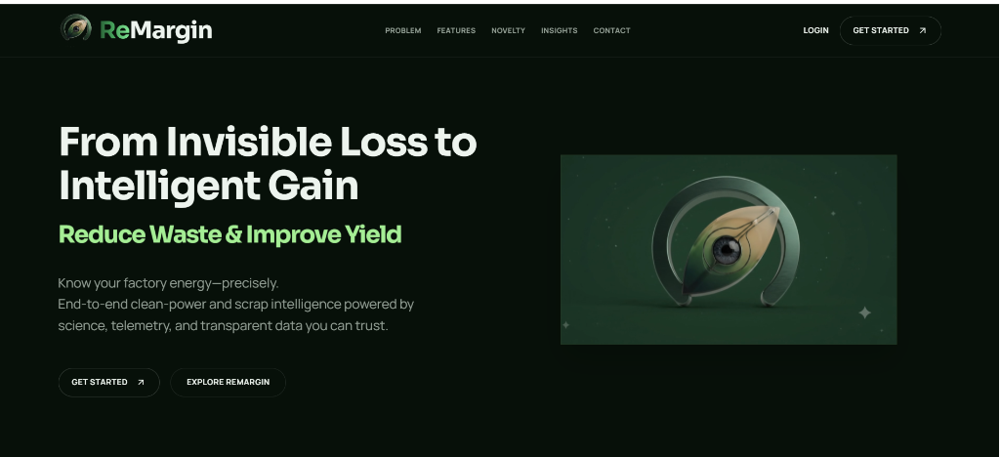
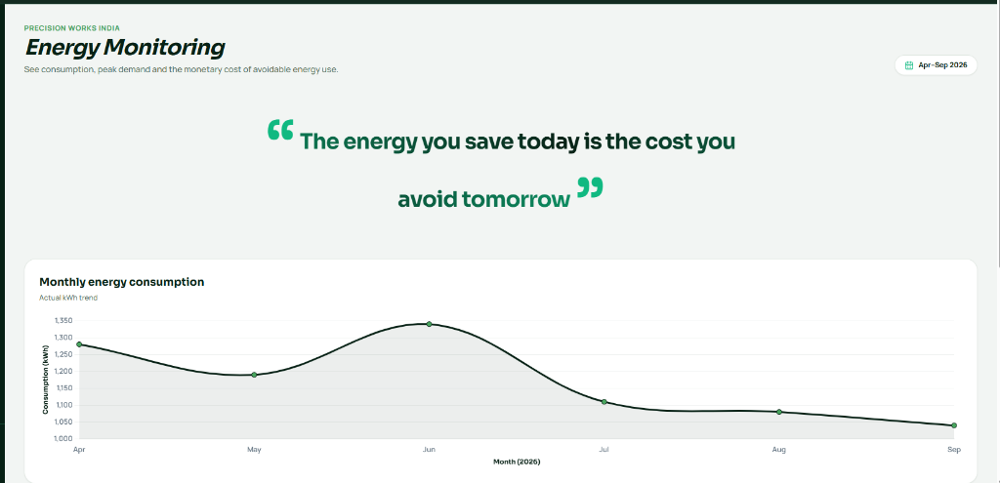
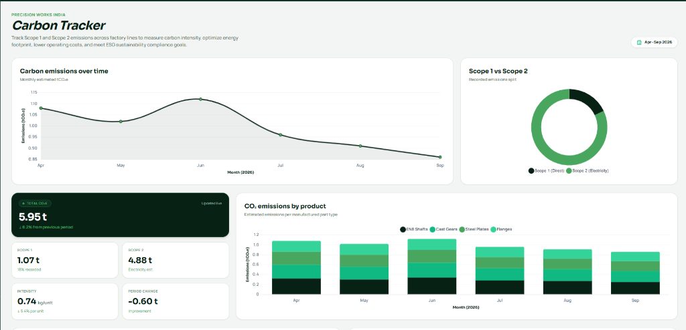
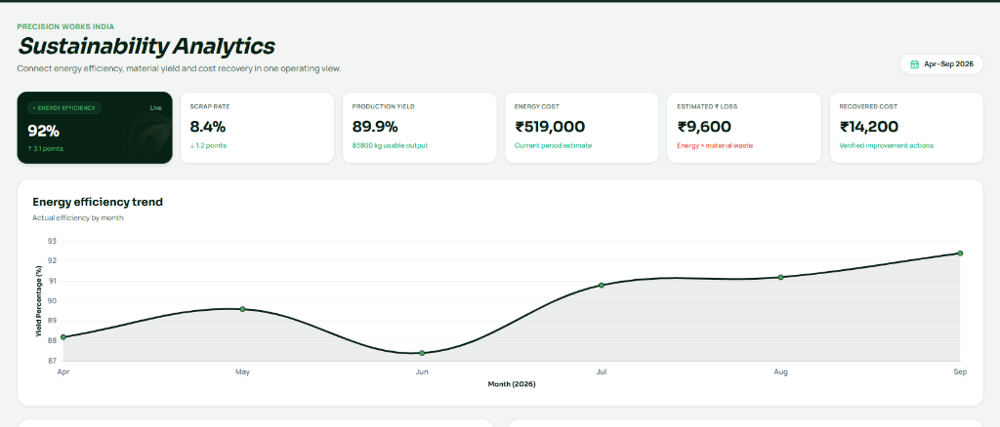
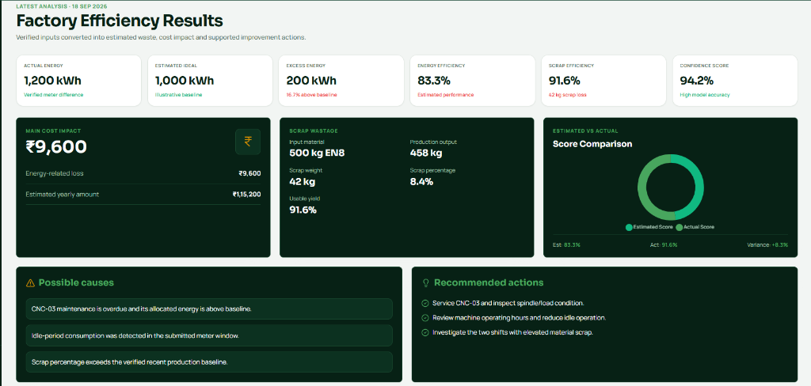

# ReMargin — Industrial Energy, Carbon & Material Yield Platform

ReMargin is an enterprise-grade industrial sustainability and operational intelligence platform designed for CNC-based micro, small, and medium enterprises (MSMEs). The platform unifies sub-meter energy telemetry, operational bill reconciliation, material scrap tracking, Scope 1 and Scope 2 carbon emissions accounting, and automated financing report generation into a single operating environment.

By translating technical energy and scrap losses directly into monetary financial impact (in Indian Rupees, ₹), ReMargin empowers shopfloor operators, plant managers, and financial executives to identify inefficiencies, implement targeted corrective actions, and produce auditable ESG, Green Loan, and Solar Investment reports.

---

## Executive Overview

Manufacturing MSMEs frequently operate with unmonitored energy leaks, unallocated auxiliary power draw, and unquantified scrap generation. Conventional energy monitoring tools focus solely on raw kilowatt-hour (kWh) metrics without linking energy waste to financial loss or carbon intensity. ReMargin bridges this operational gap by integrating sub-meter scans, production log processing, machine telemetry analysis, and automated audit-ready PDF report compilation.

### Key Capabilities
- **Sub-Meter Energy Telemetry & Verification**: Converts start/end meter readings into precise kWh consumption, identifies idle-period power draw, and flags reconciliation variances.
- **Monetary Loss & Material Scrap Accounting**: Quantifies avoidable financial loss (₹) from excess energy draw and material scrap generation across active shifts.
- **Scope 1 & Scope 2 Carbon Intensity Tracking**: Automatically calculates direct emissions (fuel/generators) and indirect emissions (grid electricity) per manufactured unit based on regional emission factors.
- **Automated Evidence Report Generation**: Produces audit-ready PDF reports for Green Loan Enablement, Solar Investment Planning, and ESG Evidence Compliance.
- **Machine & Maintenance Intelligence**: Monitors machine operating hours across active lines (CNC-01, CNC-02, CNC-03), tracks spindle load conditions, and provides diagnostic recommendations for overdue maintenance.

---

## Operational Architecture & Platform Highlights

### 1. Landing & Industrial Overview Page
The public interface presents the operational rationale, problem landscape, and core capabilities of the ReMargin operating system.



### 2. Energy Monitoring & Sub-Meter Analysis
Tracks monthly and daily energy consumption trends across active factory lines, identifying peak demand periods and calculating energy reconciliation errors against baseline expectations.



### 3. Scope 1 & Scope 2 Carbon Tracker
Monitors GHG protocol-compliant direct and indirect carbon emissions over time, analyzing carbon intensity (kgCO₂e/unit) and product-level emissions breakdown across manufactured part types (EN8 Shafts, Cast Gears, Steel Plates, Flanges).



### 4. Sustainability Analytics & Yield Optimization
Connects energy efficiency percentages, usable material yield rates, total production output, and recovered cost metrics into a unified executive view.



### 5. Factory Efficiency Results & Diagnostic Engine
Provides detailed daily analysis converting verified meter differences and shift weights into actionable diagnostic causes, score comparisons, and prioritized maintenance actions.



---

## 13-Stage Backend Architecture Pipeline

The ReMargin backend architecture is structured around a 13-stage data processing pipeline located in the `backend/` directory:

1. **Factory Setup (`/api/v1/factory`)**: Configures factory metadata, machine power ratings (cutting, idle, setup), auxiliary equipment specs, and regional grid emission factors.
2. **Data Upload (`/api/v1/upload`)**: Ingests sub-meter scans, electricity utility bills, fuel records, and daily scrap shift slips.
3. **Data Extraction (`/api/v1/extraction`)**: Executes OCR text parsing, entity extraction, and structured JSON validation on uploaded bills and documents.
4. **Energy Estimation (`/api/v1/energy`)**: Computes machine-wise cutting, idle, and setup energy breakdown along with auxiliary power draw (compressors, HVAC, coolant pumps, lighting).
5. **Energy Reconciliation (`/api/v1/reconciliation`)**: Compares actual electricity bill consumption against estimated machine and auxiliary load to compute unallocated energy and percentage variance.
6. **Confidence Scoring (`/api/v1/confidence`)**: Evaluates model accuracy metrics (MAE, RMSE, MAPE), data completeness, and bill reconciliation confidence scores.
7. **Cost Calculation (`/api/v1/cost`)**: Translates kWh consumption into financial expenditure (₹ per machine, ₹ per activity, ₹ per part, and total electricity cost).
8. **Carbon Calculation (`/api/v1/carbon`)**: Computes Scope 1 emissions (diesel/LPG fuel) and Scope 2 emissions (purchased electricity) based on grid emission metadata.
9. **Scrap Analysis (`/api/v1/scrap`)**: Evaluates input material weight, usable output, scrap loss, yield percentages, and material-embodied carbon emissions.
10. **Baseline & Trend Analysis (`/api/v1/trends`)**: Conducts multi-month historical trend analysis across energy, cost, carbon intensity, and scrap rate metrics.
11. **Opportunities & Recommendations (`/api/v1/recommendations`)**: Runs automated rules engines to identify high idle operation, process inefficiencies, and tool wear anomalies.
12. **Evidence Report Generation (`/api/v1/reports`)**: Compiles official audit-ready PDF documents for Green Loan enablement, Solar Investment planning, and ESG evidence.
13. **Dashboard & History Services (`/api/v1/dashboard`)**: Feeds real-time aggregated metrics, machine breakdowns, and historical logs to the web interface.

---

## Technical Stack & Infrastructure

- **Frontend Application**: React 19, TanStack Start, TanStack Router, Tailwind CSS, Chart.js, Lucide Icons, jsPDF.
- **Backend Services**: Python FastAPI, Pydantic Settings, SQLAlchemy, Uvicorn, Pandas, NumPy, ReportLab.
- **Repository**: [https://github.com/Kanishthika11/ReMargin](https://github.com/Kanishthika11/ReMargin)

---

## Getting Started & Running Locally

### Prerequisites
- Node.js v20.x or higher
- Python 3.10 or higher

### 1. Frontend Setup & Launch
```bash
# Clone the repository
git clone https://github.com/Kanishthika11/ReMargin.git
cd ReMargin

# Install dependencies
npm install

# Start the local development server
npm run dev
```
Access the web application at `http://localhost:8080/`.

### 2. Backend Service Setup & Launch
```bash
# Navigate to the backend directory
cd backend

# Create and activate a virtual environment
python -m venv venv
source venv/bin/activate  # On Windows: venv\Scripts\activate

# Install backend dependencies
pip install -r requirements.txt

# Launch the FastAPI service
uvicorn backend.main:app --reload --port 8000
```
Access the API documentation at `http://localhost:8000/docs`.

---

## License

This project is released under the MIT License.
